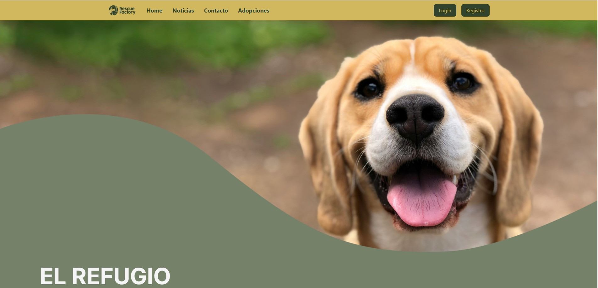
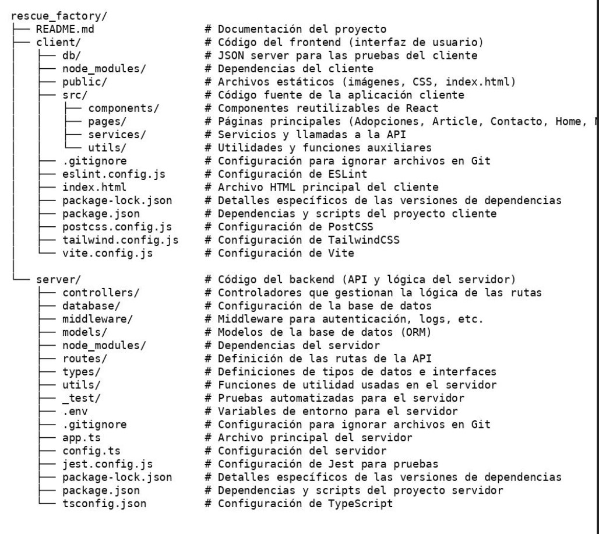

# Rescue Factory 🐾

En el corazón de nuestra comunidad, **Rescue Factory** se alza como un faro de esperanza para aquellos amigos de cuatro patas que más lo necesitan. Somos más que un simple refugio; somos una familia dedicada a transformar vidas, tanto de animales como de personas, a través del amor incondicional y el compromiso inquebrantable.



---

## Índice 📑

1. [Lo Que Hacemos](#lo-que-hacemos)
2. [Características](#características)
3. [Tecnologías Usadas](#tecnologías-usadas)
4. [Instalación](#instalación)
5. [Recursos](#recursos)
6. [Estructura del Proyecto](#estructura-del-proyecto)
7. [Futuras Mejoras](#futuras-mejoras)

---

## Lo Que Hacemos 🐶🐱

- Rescatamos a perros y gatos en situación de vulnerabilidad.
- Proporcionamos atención veterinaria completa.
- Ofrecemos un ambiente seguro y amoroso durante su recuperación.
- Trabajamos incansablemente en encontrar hogares perfectos para cada uno de nuestros residentes.
- Realizamos un cuidadoso proceso de adopción para asegurar el mejor match entre mascotas y familias.

**Porque creemos que cada vida peluda merece una segunda oportunidad, y cada hogar se hace más feliz con el amor incondicional de una mascota rescatada.**

En **Rescue Factory**, no solo salvamos vidas, creamos familias. 💖

---

## Características ✨

- **Adopciones**: Ver animales disponibles para adopción.
- **Noticias sobre cuidado animal**: Publicaciones sobre el cuidado personal de cada animal.
- **Contacto**: Espacio para resolver dudas y preguntas.
- **Sistema de Logueo**: Permite el registro y acceso de usuarios.

---

## Tecnologías Usadas 💻

Utilizamos una variedad de herramientas y tecnologías para ofrecer la mejor experiencia tanto en el backend como en el frontend:

- : Entorno de ejecución para JavaScript en el backend.
- : Framework para crear el servidor y manejar las rutas.
- : Sistema de gestión de bases de datos relacional.
- [](https://sequelize.org/): ORM para MySQL, que facilita la interacción con la base de datos.
- : Framework para realizar pruebas unitarias.
- : Herramienta para probar endpoints de la API.
- : Utilizado para probar y documentar las rutas de la API.
- : Biblioteca de JavaScript para construir interfaces de usuario interactivas.
- : Para una navegación fluida y gestión del enrutado con `createBrowserRouter`.
- : Simplifica la gestión de formularios con el hook `useForm`.
- : Para realizar solicitudes HTTP asíncronas al servidor.
- : Proporciona una API simulada rápida y fácil para las operaciones CRUD.
- : Para autenticación segura.
- : Middleware para manejo de archivos.
- : Gestión de imágenes y archivos multimedia.


---

## Instalación 🛠️

Sigue estos pasos para instalar y configurar el proyecto:

1. **Clona el repositorio**:

    ```bash
    git clone https://github.com/a-bac-0/rescue_factory.git
    ```

2. **Instalar dependencias en el frontend**:

    ```bash
    cd rescue_factory/client
    npm install
    ```

3. **Instalar dependencias en el backend**:

    ```bash
    cd rescue_factory/server
    npm install
    ```

4. **Configurar variables de entorno**:
    Crea un archivo `.env` en el directorio `server` con las siguientes configuraciones:

    ```bash
    DB_PASSWORD="Contraseña de conexión en MySQL Workbench"
    DB_USERNAME="Usuario en Workbench"
    DB_DATABASE=rescue_factory
    DB_TEST_NAME=rescue_factory_test
    DB_HOST=localhost
    DB_DIALECT=mysql
    DB_PORT="El puerto que tengas configurado en Workbench"
    NODE_ENV=development
    JWT_SECRET=contraseña
    ```

5. **Ejecutar el proyecto desde ambos lados (client y server)**:

    ```bash
    npm run dev
    ```

---

## Recursos 📚

- [Diseño de Figma](https://www.figma.com/design/hum3ez7t62ML2RKGUHKgV0/Rescue-Factory?node-id=29-13&node-type=canvas&t=4j8HTuJP0Mtnrd0Q-0)
- [Diseño de la base de datos en DrawSQL](https://drawsql.app/teams/factoria-8/diagrams/rescue-factory)

---

## Estructura del Proyecto 🏗️

La estructura del proyecto es la siguiente:



---

## Futuras Mejoras 🚀

- Panel para administradores con permisos y gestión de usuarios.
- Configuración del validador del token en el frontend para mejorar la seguridad.

---

Gracias por tu interés en **Rescue Factory**. ¡Esperamos que disfrutes contribuyendo a esta causa!
